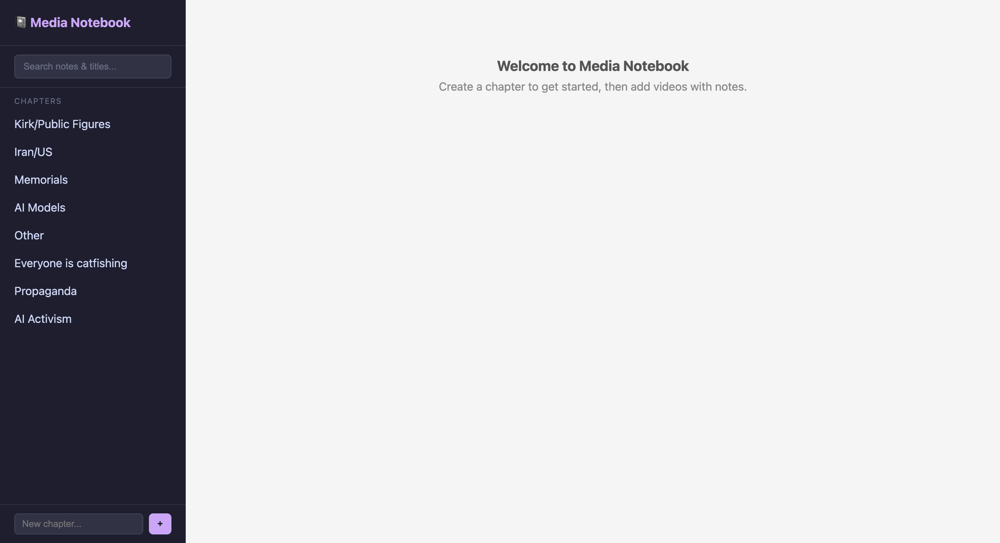

# Digital Culture Notebook

A personal media notebook web app for saving videos with rich-text notes — like Evernote, but for videos. Supports downloading from YouTube, TikTok, Instagram, and other platforms via yt-dlp.



## Features

- **Notebooks** — Create multiple notebooks, each with its own set of chapters
- **Chapters** — Organize content into named chapters within a notebook, each with its own rich-text notes
- **Video Entries** — Paste a URL, download the video locally, and write notes alongside it
- **Rich Text Editor** — Bold, italic, lists, and headings via Quill.js
- **Search** — Keyword search across all notes and video titles
- **HTML Export** — Export any chapter as a clean, readable standalone HTML page
- **Organized File Storage** — Videos and notes saved in `media/Notebook_Name/Chapter_Name/` with clean filenames
- **Fully Local** — No cloud, no accounts. Videos and notes stay on your machine

## Setup

### Requirements

- Python 3.10+
- [yt-dlp](https://github.com/yt-dlp/yt-dlp) (installed via pip)

### Install

```bash
pip install -r requirements.txt
```

### Run

```bash
cd app
uvicorn main:app --reload --port 8080
```

Then open [http://localhost:8080](http://localhost:8080) in your browser.

### macOS Desktop App (optional)

A `Media Notebook.app` can be placed on your Desktop to launch the server and open your browser with one click. To set it up:

1. Copy the `Media Notebook.app` bundle to your Desktop (or Applications folder)
2. Edit `Contents/MacOS/launch` and set `APP_DIR` to the full path of your `app/` folder
3. Double-click to launch

If macOS blocks it on first run, right-click the app and choose **Open**, or go to **System Settings → Privacy & Security** and click **Open Anyway**.

## Usage

1. **Create a notebook** — Use the notebook dropdown at the top of the sidebar; click **+** to create, **✏** to rename, **✕** to delete
2. **Create a chapter** — Type a name in the sidebar and click **+**
3. **Add chapter notes** — Use the rich-text editor at the top of each chapter for general notes
4. **Add a video entry** — Paste a video URL (YouTube, TikTok, Instagram, etc.) and click **Download & Save**
5. **Edit notes** — Each entry has its own rich-text editor; click **Save Notes** to persist (also saved as a .txt file alongside the video)
6. **Search** — Use the search bar in the sidebar to find entries by title or note content
7. **Export** — Click **Export HTML** to generate a clean, readable page for any chapter
8. **Delete** — Remove entries with the **Delete** button, or delete entire chapters from the sidebar

## Project Structure

```
app/
  main.py          # FastAPI backend (API + page serving)
  database.py      # SQLite setup and migrations
  downloader.py    # yt-dlp wrapper with browser cookie support
  templates/       # Jinja2 HTML templates
  static/          # CSS, JS, icon
  media/           # Downloaded videos and notes (git-ignored)
    My_Notebook/
      Chapter_1/
        video_title.mp4
        video_title.txt   # Notes saved alongside video
  notebook.db      # SQLite database (git-ignored)
requirements.txt
```

## Notes

- Videos are stored locally in `app/media/` and served by the backend
- The database (`notebook.db`) is auto-created on first run
- For age-restricted YouTube videos, the downloader attempts to use cookies from your browser (Chrome, Firefox, Safari)
